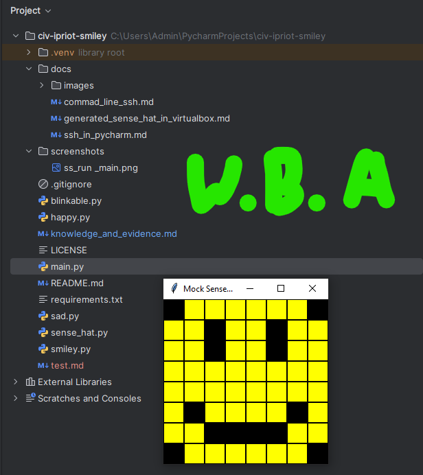
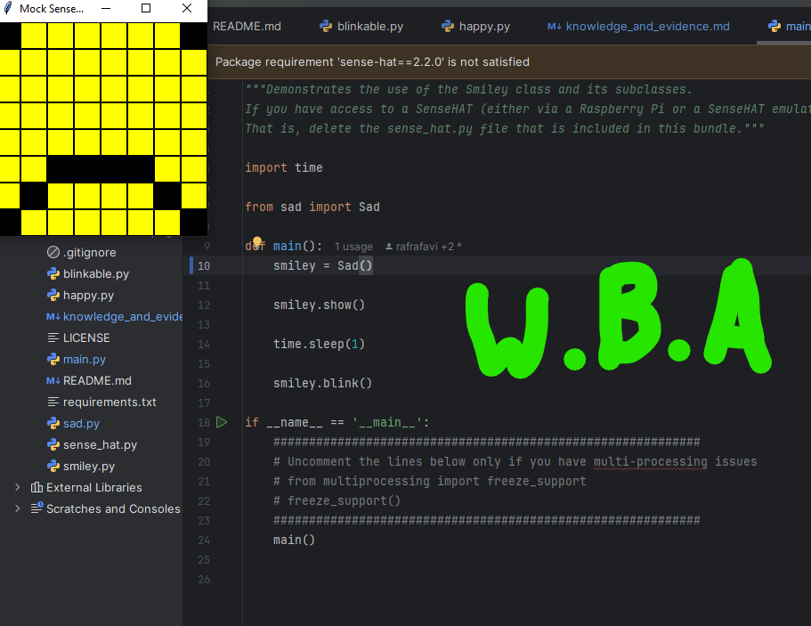
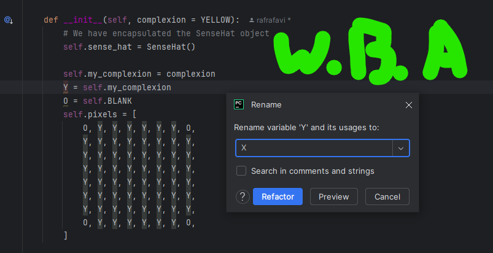

<style>

body {
    counter-reset: h2counter;
}

/* H1 - No numbering */
h1 {
    /* No counter reset or increment */
}

/* H2 - Level 1 numbering */
h2 {
    counter-reset: h3counter;
}

h2::before {
    counter-increment: h2counter;
    content: counter(h2counter) ". ";
}

/* H3 - Level 2 numbering */
h3 {
    counter-reset: h4counter;
}

h3::before {
    counter-increment: h3counter;
    content: counter(h2counter) "." counter(h3counter) " ";
}

/* H4 - Level 3 numbering (optional) */
h4 {
    counter-reset: h5counter;
}

h4::before {
    counter-increment: h4counter;
    content: counter(h2counter) "." counter(h3counter) "." counter(h4counter) " ";
}

</style>

# Evidence and Knowledge

This document includes instructions and knowledge questions that must be completed to receive a *Competent* grade on this portfolio task.

## Required evidence

### Answer all questions in this document

- Each answer should be complete, well-articulated, and within the specified word count limits (if added) for each question.
- Please make sure **all** external sources are properly cited.
- You must **use your own words**. Please include your full chat transcripts if you use generative AI in any way.
- Generative AI hallucinates, is not an authoritative source

### Make all the required modifications to the code

- Please follow the instructions in this document to make the changes needed to the code.

- When requested to upload evidence, upload all screenshots to `screenshots/` and embed them in this document. For example:

```markdown

```

- You must upload the code into your GitHub repository.
- While you can use a branch, your code should be in main when you submit.
- Upload a zip of this repository to Blackboard when you are ready to submit.
- You will be notified of your result via Blackboard
- However, if using GitHub classrooms, you may also receive additional feedback on GitHub directly

### Optional: Use of Raspberry Pi and SenseHat

Raspberry Pi or SenseHat is **optional** for this activity. You can use the included `sense_hat.py` file to simulate the SenseHat on your computer.

If you use a Pi, please **delete** the `sense_hat.py` file.

### Accessible version of the code

This project relies on visual patterns that appear on an LED matrix. If you have any accessibility requirements, you can use the `udl/accessible` branch to complete the project. This branch provides an accessible code version that uses text-based patterns instead of visual ones.

Please discuss this with your lecturer before using that branch.

## Specific Tasks & Questions

Address the following tasks and questions based on the code provided in this repository.

### Set up the project locally

1. Fork this repository (if not using GitHub Classrooms)
2. Clone your repository locally
3. Run the project locally by executing the `main.py` file
4. Evidence this by providing screenshots of the project directory structure and the output of the `main.py` file




If you are running on a Raspberry Pi, you can use the following command to run the project and then screenshot the result:

```bash
ls
python3 main.py
```

### Fundamental code comprehension

 Answer each of the following questions **as they relate to that code** supplied by in this repository (ignore `sense_hat.py`):

1. Examine the code for the `smiley.py` file and provide  an example of a variable of each of the following types and their corresponding values (`_` should be replaced with the appropriate values):

   | Type                    | name         | value        |
   | ----------              |--------------|--------------|
   | built-in primitive type | dimmed       | True         |
   | built-in composite type | YELLOW       | (255, 255, 0)|
   | user-defined type       | class Smiley | Smiley       |

2. Fill in (`_`) the following table based on the code in `smiley.py`:

   | Object                   | Type      |
   | ------------             |-----------|
   | self.pixels              | list      |
   | A member of self.pixels  | Y         |
   | self                     | parameter |

3. Examine the code for `smiley.py`, `sad.py`, and `happy.py`. Give an example of each of the following control structures using an example from **each** of these files. Include the first line and the line range:

   | Control Flow | File     | First line | Line range |
   | ------------ |----------|------------|------------|
   |  sequence    | happy.py | 39         | 43         |
   |  selection   | sad.py   | 26         | 29         |
   |  iteration   | sad.py   | 16         | 17         |

4. Though everything in Python is an object, it is sometimes said to have four "primitive" types. Examining the three files `smiley.py`, `sad.py`, and `happy.py`, identify which of the following types are used in any of these files, and give an example of each (use an example from the code, if applicable, otherwise provide an example of your own):

   | Type                    | Used?                                                                            | Example               |
   | ----------------------- |----------------------------------------------------------------------------------|-----------------------|
   | int                     | No. but integer is used in tuple and list, and these are non-primitive data type | age = 20              |
   | float                   | Yes. In happy.py. line 33                                                        | delay = 0.25          |
   | str                     | No.                                                                              | choc_brand = "Kitkat" |
   | bool                    | Yes. In happy.py. line 24.                                                       | wide_open = True      |

5. Examining `smiley.py`, provide an example of a class variable and an instance variable (attribute). Explain **why** one is defined as a class variable and the other as an instance variable.

> An example of Class Variable :   WHITE = (255,255,255)   
> An example of Instance variable : O = self.blank
> 
> WHITE variable is a class variable because it is not a variable defined inside the method/function of a class.
> On the other hand, 0 is a instance variable because it is defined inside method/function of a class.\
> Even though O has a fixed value but mostly instance variable has its own unique value when an instance/object is created.\
> e.g.
> <pre>
> class Person:\
>   def __init__(self, name, age)\
>       self.name = name
>       self.age = age
>
> person_1 = Person("Rob", 20)
> person_2 = Person("Tiff", 18)
> </pre>
6. Examine `happy.py`, and identify the constructor (initializer) for the `Happy` class:
   1. What is the purpose of a constructor (in general) and this one (in particular)?

   > In general, the constructor is a function/method that contains attributes, which will be automatically called, when an instance is created.\
   > In Happy Class, the constructor is a default constructor that has no additional parameter or attributes. Thus, when called the instance variable will automatically run.\
   > A simple example will be:
   > <pre>
   > class greeter:
   >    def __init__(self): # note that there is no additional parameter and attributes.
   >        self.message = "Hello World"
   > Greet_1 = greeter()
   > print(Greet_1)
   > </pre>
   > <pre>
   > Output:
   > Hello World
   


   2. What statement(s) does it execute (consider the `super` call), and what is the result?

   > The statement it will executed will be the function of:\
   > super().__init__()\
   > self.draw_mouth()\
   > self.draw_eyes()\
   > The result is that super() inherits the attributes from the parent classes of Smiley and Blinkable. And runs the functions or draw_mouth and draw_eyes.
    
### Code style

1. What code style is used in the code? Is it likely to be the same as the code style used in the SenseHat? Give to reasons as to why/why not:
   
> The code style is PEP8. Yes it is the same code style in SenseHat. 
> Since the spacing of each function is the same and they are all using Camel_case for defining class.
> And snake_case for defining method and function. e.g. def draw_mouth & def draw_eye.

2. List three aspects of this convention you see applied in the code.

> 1. 4 spaces of indentation
> 2. methods/functions inside a class has one blank line
> 3. one import on one line i.e import os & import sys instead of import os,sys
>

3. Give two examples of organizational documentation in the code.

> An example of organization documentation in the code is the docstring in main.py the introduction:
> <pre>
> """Demonstrates the use of the Smiley class and its subclasses.
> If you have access to a SenseHAT (either via a Raspberry Pi or a SenseHAT emulator), you can use the real SenseHAT class instead of the mock SenseHAT class.
> That is, delete the sense_hat.py file that is included in this bundle."""
> </pre>
> Another example is in the main.py which are the comments:
> <pre>
>if __name__ == '__main__':
>   ############################################################
>   # Uncomment the lines below only if you have multi-processing issues
>   # from multiprocessing import freeze_support
>   # freeze_support()
>   ############################################################
> </pre>
> And another example will be the LICENSE document in the project (however, I am unsure it is an example of this question as it is not in the code)

### Identifying and understanding classes

> Note: Ignore the `sense_hat.py` file when answering the questions below

1. List all the classes you identified in the project. Indicate which classes are base classes and which are subclasses. For subclasses, identify all direct base classes.
  
  Use the following table for your answers:

| Class Name | Super or Sub? | Direct parent(s)   |
|-----------|---------------|--------------------|
| NotReal   | Sub           | NotRealParent      |
| Happy     | Sub           | Smiley & Blinkable |
| Sad       | Sub           | Smiley             |
| Blinkable | Sub           | ABC                |
| Smiley    | Parent        | N/A                |

2. Explain the concept of abstraction, giving an example from the project (note "implementing an ABC" is **not** in itself an example of abstraction). (Max 150 words)

> In Object Oriented Programming,  abstraction is concept of creating blueprints that contains non-concrete methods or concrete methods.\
> An abstraction that with concrete method is called an abstract class. In other words, it does not allow its subclasses to have its own unique attributes, and those subclasses must implement the defined methods/functions in the abstract class.\
> An abstraction that with non-concrete method is called an interface class. In other words, it allow subclasses to implement its own unique attributes to the defined methods/function.\
> An example of abstraction is the class Blinkable with an abstract class of blink.

3. What is the name of the process of deriving from base classes? What is its purpose in this project? (Max 150 words)

> The process of deriving from base classes is called inheritance. As its name implies, the purpose of inheritance is to inherits the attributes of the parent class.
>

### Compare and contrast classes

Compare and contrast the classes Happy and Sad.

1. What is the key difference between the two classes?
   > The key differences are:
   > 1. there is not blink method in  class Sad but there is a blink method is class Happy.
   > 2. Class Happy inherit the base class Blinkable but class Sad does not.
   >
2. What are the key similarities?
   > The key similarities are:\
   > 1. they both have construction method init()
   > 2. They both have methods of draw_eyes() and draw_mouth()
   > 3. the value for variable mouth is different. i.e. for Happy, mouth = [41, 46, 50, 51, 52, 53], for class Sad, mouth = [49, 54, 42, 43, 44, 45].
   >
3. What difference stands out the most to you and why?
   > The difference that stands out the most are:
   > 1. mouth variable value.
   > 2. Blinkable
   >
4. How does this difference affect the functionality of these classes
   > When run, class Sad does not blink, and its mouth has an open-semi circle that bend upwards
   > 

### Where is the Sense(Hat) in the code?

1. Which class(es) utilize the functionality of the SenseHat?
   > The classes that uses functionality of SenseHat are Smiley, Happy, and Sad.
   >
2. Which of these classes directly interact with the SenseHat functionalities?
   > Smiley is directly interact with SenseHat functionalities.
   >
3. Discuss the hiding of the SenseHAT in terms of encapsulation (100-200 Words)
   > The hiding of SenseHAT is to prevent others to make changes to its original values. Thus, making it private method or functions that cannot be accessed when instantiate the class. And by hiding information that cannot be accessed is called encapsulation.\
   > This is to ensure that other programmer will not tamper the original coding but provide them only methods to present different Smiley faces.\
   > In short, the original coding is protected from other programmer but other programmer can still use to make their Smiley faces. e.g. the "omg" smiley.
   > In OOP, encapsulation is used to hide values that the programmer does not want the user to make changes. For example, bank account number.

### Sad Smileys Can’t Blink (Or Can They?)

Unlike the `Happy` smiley, the current implementation of the `Sad` smiley does not possess the ability to blink. Let's first explore how blinking has been implemented in the Happy Smiley by examining the blink() method, which takes one argument that determines the duration of the blink.

**Understanding Blink Mechanism:**

1. Does the code's author believe that every `Smiley` should be able to blink? Explain.

> I am assuming the author does not believe every Smiley should be able to blink because not every emotion needs the eye to blink.\
> Take the crying Smiley, for an example, when some human cries, our eyes is closed most of the time so the blink method does not apply to cries Smiley.\
> Another example will be raise eyebrows Smiley, if blink applied on raise eyebrows Smiley, it would be weird as, in reality, raising eyebrows open up the human eyes.
> In short, I do not think that the code's author believe every Smiley should blink. That is why blink is excluded from sad.py. Smiley.
> Lastly, we can see that in blinkable.py is a separate class and the blink remains open code. In other words, the author did not hard code or there is no concrete methods in blinkable. 
> if the author believes every Smiley should blink. the author would have define blink as a method in smiley.py.
>

2. For those smileys that blink, does the author expect them to blink in the same way? Explain.

> No. I do not believe that the author expect them to blink in a same way. As previous answer, that is the author define blinkable as a separate class not an attribute of Smiley.
> And the there is no concrete method in blinkable.py. 
>

3. Referring to the implementation of blink in the Happy and Sad Smiley classes, give a brief explanation of what polymorphism is.

> Polymorphism, in my understanding, it is just a parent class without concrete method that allows method overriding and overloading when the subclass is defined.
> From the author code example will be the happy.py inherits a parent class of Smiley and Blinkable. 
> Since the Blinkable parent class does not have a concrete method, it allows the author to define its own blink method in happy.py.
>

4. How is inheritance used in the blink method, and why is it important for polymorphism?

> Inheritance used in the blink method as a super class interface. In other words, when happy inherits the attribute of blinkable, the author must define the blink method. 
> If the author did not define the blink method in happy.py, the code would not run. 
> It is important because the purpose of polymorphism is to encourage reusability of the code and to simplify our coding system by reminding the author to define that open method.
>
>Imagine that we have thousands of smiley, and we have to include blink method in hundreds of smiley. So can we guarantee that we will include blink method that hundreds of Smiley? 
> Personally, I may forget to include blink method in some Smiley. So, it is better to inherit a non-concrete class to remind ourselve to include a blink method in that particular Smiley.
> In other words, it is like we set a reminder to tell ourselves that "hey, this Smiley needs a blink method".
>
1. **Implement Blink in Sad Class:**

   - Create a new method called `blink` within the Sad class. Ensure you use the same method signature as in the Happy class:

   ```python
   def blink(self, delay=0.25):
       pass  # Replace 'pass' with your implementation
   ```

2. **Code Implementation:** Implement the code that allows the Sad smiley to blink. Use the implementation from the Happy Smiley as a reference. Ensure your new method functions similarly by controlling the blink duration through the `delay` argument.

3. **Testing the Implementation:**

- Test the new blink functionality on your Raspberry Pi or within the Python classes provided. You might need to adjust the `main.py` script to incorporate Sad Smiley's new blinking capability.

Include a screenshot of the sad smiley or the modified `main.py`:



- Observe and document the Sad smiley as it blinks its eyes. Describe any adjustments or issues encountered during implementation.

  > The adjustments or issues I encounter is I encounter NameError of Sad during my 1st implementation. And I realize that the main.py hide the import statement of "from happy import Happy.". 
  > It is an obvious adjustment as I just need to change "from happy import Happy" to "from sad import Sad"\
  >
  > The second adjustment I encounter is I did not import time in sad.py. So my sad smiley close its eyes did not open its eyes back.
  > So, I have to add the statement import time at the beginning of sad.py to solve the forever closing eyes.
  > 

  ### If It Walks Like a Duck…

  Previously, you implemented the blink functionality for the Sad smiley without utilizing the class `Blinkable`. Assuming you did not use `Blinkable` (even if you actually did), consider how the Sad smiley could blink similarly to the Happy smiley without this specific class.

  1. **Class Type Analysis:** What kind of class is `Blinkable`? Inspect its superclass for clues about its classification.

     > It is an abstract/incomplete class as it does not have concrete method and it has a common attribute of blink. Since it is incomplete, the blink method is meant to complete by its subclasses.

  2. **Class Implementation:** `Blinkable` is a class intended to be implemented by other classes. What generic term describes this kind of class, which is designed for implementation by others? **Clue**: Notice the lack of any concrete implementation and the naming convention.

  > As above, it is an abstract/incomplete class.

  3. **OO Principle Identification:** Regarding your answer to question (2), which Object-Oriented (OO) principle does this represent? Choose from the following and justify your answer in 1-2 sentences: Abstraction, Polymorphism, Inheritance, Encapsulation.

  > This is abstraction as the author wants to hide the parent class when implementation. However, this abstraction allows other subclass to override the hidden parent class. 

  4. **Implementation Flexibility:** Explain why you could grant the Sad Smiley a blinking feature similar to the Happy Smiley's implementation, even without directly using `Blinkable`.

  > It is simply because the class Blinkable is just an empty class to serve as a reminder and to ease up the implementation when calling the function/method. 
  > Nothing stops us to define another attribute or behaviour in each subclass that inherits Smiley. However, it may not be a good coding practice to rewrite blink method in each Smiley.
  > Thus, to ease up our coding process, it is better to define an class with open or concrete method. e.g. we do not want to rewrite "pi =3.142" in each  mathematics program, we just want to reuse the "pi" math module.
  > Moreover, some people may define pi as 3.14 instead of 3.142. Thus, it is best to use blueprint concept like polymorphism and abstraction to ensure a standard  "pi" is achieved throughout the main program.

  5. **Concept and Language Specificity:** In relation to your response to question (4), what is this capability known as, and why is it feasible in Python and many other dynamically typed languages but not in most statically typed programming languages like C#? **Clue** This concept is hinted at in the title of this section.

  > IT is called duck typing in programming language. It is feasible in dynamic language like Python because it only cares about the functions and method of the code and does not care whether a variable type is defined consistently throughout the code.
  > On the other hand, static typing like C++ requires the programmer to declare their variable type before runtime. if not the program will not run.

  ***

  ## Refactoring

  ### Does a Smiley Have to Be Yellow?

  While our current implementation predominantly features yellow smileys, emotional expressions like sickness or anger typically utilize colors like green, red, or orange. We'll explore the feasibility of integrating these colors into our smileys.

  1. **Defined Colors and Their Location:**

     1. Which colors are defined and in which class(s)?
        > The colors that are defined are WHITE, GREEN, YELLOW, RED, and BLANK. It is in the Smiley class.
     2. What type of variables hold these colors? Are the values expected to change during the program's execution? Explain your answer.
        > The variable type is an instance variable in the constructor method. 
        > Its data structure collection type is tuple which indicates that the values are not expected to change.
        > Additionally, the three value represent the Red, Green, and Blue value. And, since each color has its own value, changing any of value will only change the color.
        > So, I do not think that the values for instance variable WHITE, GREEN, YELLOW, RED, and BLANK will change.
     3. Add the color blue to the appropriate class using the appropriate format and values.
        > I have added instance variable, BLUE = (0,0,255) to the Smiley class's constructor method.
        
  2. **Usage of Color Variables:**

     1. In which classes are the color variables used?
        > The color variables are used in Sad class on line 18 & 28 & 30, in Happy Class on line 22 & 31, and in Smiley class on line 16 to 27.


  3. **Simple Method to Change Colors:**
  4. What is the easiest way you can think to change the smileys to green? Easiest, not necessarily the best!
  > The easiest is to change the instance variable Y = self.YELLOW to Y = self.GREEN in Smiley class. And in line 33 Happy class from self.YELLOW to self.GREEN.
  > Similarly, in line 30 for Sad class from self.YELLOW to self.GREEN.

  Here's a revised version of the "Flexible Colors – Step 1" section for the smiley project, incorporating your specifications for formatting and content updates:

  ### Flexible Colors – Step 1

  Changing the color of the smileys once is straightforward, but it isn't very flexible. To facilitate various colors for smileys, it is advisable not to hardcode values in any class. This approach was identified earlier as a necessary change. Let's start by removing the built-in assumptions about color in our classes.

  1. **Add a method called `complexion` to the `Smiley` class:** Implement this instance method to return `self.YELLOW`. Using the term "complexion" instead of "color" provides a more abstract terminology that focuses on the meaning rather than implementation.

  2. **Refactor subclasses to use the `complexion` method:** Modify any subclass that directly accesses the color variable to instead utilize the new `complexion` method. This ensures that color handling is centralized and can be easily modified in the future.

  3. **Determine the applicable Object-Oriented principle:** Consider whether Abstraction, Polymorphism, Inheritance, or Encapsulation best applies to the modifications made in this step.

  4. **Verify the implementation:** Ensure that the modifications function as expected. The smileys should still display in yellow, confirming that the new method correctly replaces the direct color references.

  This step is crucial for setting up a more flexible system for color management in the smiley display logic, allowing for easy adjustments and extensions in the future.

  ### Flexible Colors – Step 2

  Having removed the hardcoded color values, we now enhance the base class to support dynamic color assignments more effectively.

  1. **Modify the `__init__()` method in the `Smiley` class:** Introduce a default argument named `complexion` and assign `YELLOW` as its default value. This allows the instantiation of smileys with customizable colors.

  2. **Introduce a new instance variable:** Create a variable called `my_complexion` and assign the `complexion` parameter to it. This step ensures that each smiley instance can maintain its own color state.

  3. **Rationale for `my_complexion`:** Using a distinct instance variable like `my_complexion` avoids potential conflicts with the method parameter names and clarifies that it is an attribute specific to the object.

  4. **Bulk rename:** We want to update our grid to use the value of complexion, but we have so many `Y`'s in the grid. Use your IDE's refactoring tool to rename all instances of the **symbol** `Y` to `X`. Where `X` is the value of the `complexion` variable. Include a screenshot evidencing you have found the correct refactor tool and the changes made.

  

  5. **Update the `complexion` method:** Adjust this method to return `self.my_complexion`, ensuring that whatever color is assigned during instantiation is what the smiley displays.

  6. **Verification:** Run the updated code to confirm that Smileys still defaults to yellow unless specified otherwise.

  ### Flexible Colors – Step 3

  With the foundational changes in place, it's now possible to implement varied smiley colors for different emotional expressions.

  1. **Adjust the `Sad` class initialization:** In the `Sad` class's initializer method, change the superclass call to include the `complexion` argument with the value `self.BLUE`, as shown:

     ```python
     super().__init__(complexion=self.BLUE)
     ```

  2. **Test color functionality for the Sad smiley:** Execute the program to verify that the Sad smiley now appears blue.

  3. **Ensure the Happy smiley remains yellow:** Confirm that changes to the Sad smiley do not affect the default color of the Happy smiley, which should still display in yellow.

  4. **Design and Implement An Angry Smiley:** Create an Angry smiley class that inherits from the `Smiley` class. Set the color of the Angry smiley to red by passing `self.RED` as the `complexion` argument in the superclass call.

  ***
